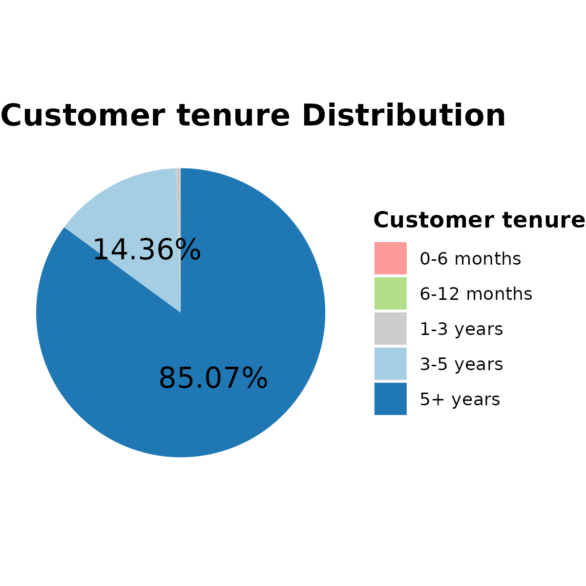
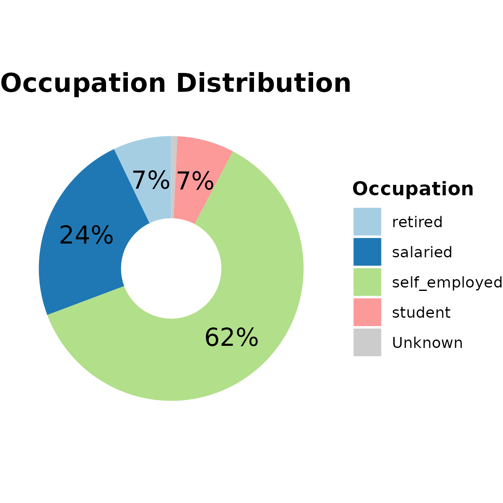
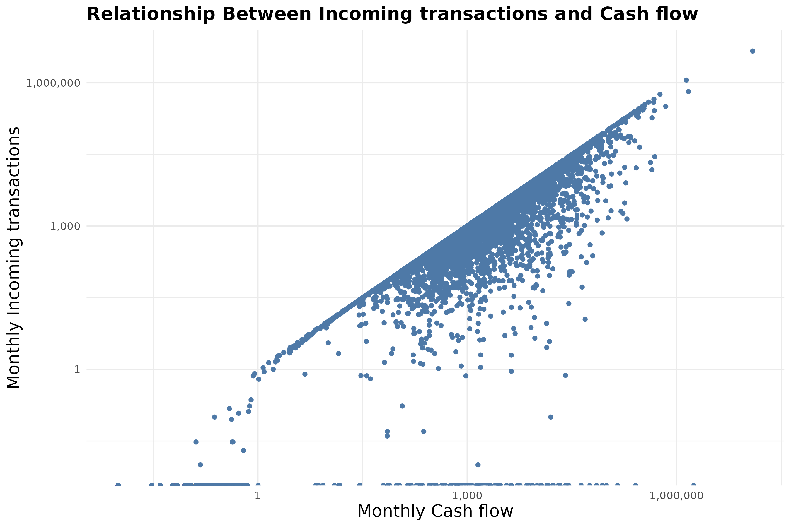
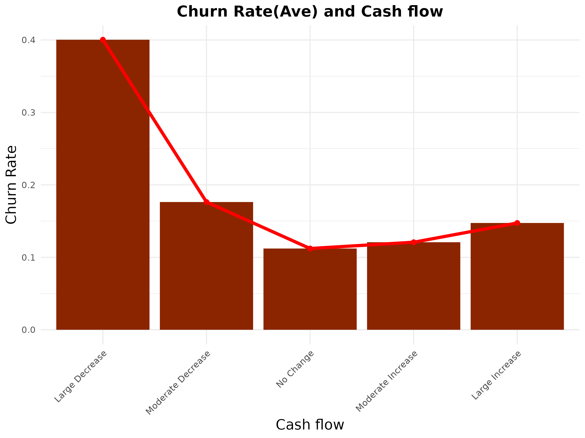

# 🏦 Bank Customer Churn Analysis

Author: Shota Terajima

Date: December 15th, 2025

## **Introduction**

Customer retention has become one of the most critical challenges in the banking industry. As competition intensifies and customers have more choices than ever, banks must understand why customers decide to leave.

Therefore, identifying the key factors that contribute to customer churn is essential for designing effective retention strategies.

In this project, I analyze an open-source banking churn dataset licensed under Apache License 2.0, which contains customer demographic information, financial details, account behaviors, and churn indicators. Using the Google Data Analytics framework (Ask, Prepare, Process, Analyze, Share, Act), I explore patterns across age groups, balances, tenure, transaction activity, and cash flow to identify customer segments most at risk of churn.

This case study aims to provide clear, data-driven insights that banks can use to improve customer engagement, strengthen loyalty strategies, and ultimately reduce churn.

### 

## **Ask (Business Task)**

**Goal:** Identify which customer factors and segments are most strongly associated with churn in a retail banking context.

**Key stakeholders:**

* Bank management
* Customer retention and marketing teams
* Product and strategy teams

## **Prepare (Data Understanding)**

### 

**Dataset:** Bank Customer Churn Data (raw data)

**License:** Apache License 2.0

**Source:** Open-source dataset for educational purposes

**ROCCC Assessment:**

Reliable: Low (no verification from first-party financial institutions)

Original: Low (third-party dataset)

Comprehensive: Medium (approximately 20,000 records with multiple customer attributes)

Current: Low (data collected approximately 6 years ago)

Cited: Low (limited metadata and documentation)

**The dataset has limitations:**

* Significant missing gender information among elderly customers, particularly those aged 90.
* Inconsistent and unrealistic values in the occupation field (e.g., very young customers labeled as students).
* Overrepresentation of self-employed customers, which may not reflect a typical banking population.
* Lack of contextual information for geographic variables, such as city and branch code.
* Customer activity is available only for the most recent two months, limiting long-term behavioral analysis.

## **Process (Data Cleaning \& Transformation)**

The dataset required extensive preprocessing before analysis.

Data cleaning and transformation were primarily conducted using Google Sheets and R.

**Key steps included:**

Removing duplicate records

**Handling missing values:**

* Dropped rows when missing values were random and minimal
* Created an "Unknown" category for missing categorical variables

**Correcting invalid or illogical values:**

* Replaced numeric anomalies with median values
* Assigned "Unknown" for ambiguous categorical entries

**Feature engineering:**

* Created new variables such as net monthly cash flow
* Generated categorical buckets (e.g., balance, tenure, cash flow) to support segmentation analysis

## **Analyze**

###### 

### 1\. Analyze Step — Framework (Outline)

The Analyze step focuses on identifying patterns in customer demographics, tenure, and financial behavior to provide context for churn. Exploratory data analysis is used to understand who the customers are, how they interact with the bank, and which financial signals are associated with churn.

**This analysis:**

* Describes customer composition (gender, occupation)
* Evaluates customer tenure (vintage) to understand retention structure
* Examines relationships between balances, cash flow, incoming transactions, and churn
* Compares observed patterns with real-world banking and workforce trends to assess external validity

### 2\. Key Charts \& Insights

**Chart 1: Gender Distribution (Pie Chart)**

**Insight:** Male customers are the most common group in the dataset, followed by female customers.

**Descriptive finding:**

Male customers constitute the largest segment in the dataset, followed by female customers. This pattern aligns with global financial inclusion trends reported by the World Bank, which show higher bank account ownership rates among men than women.

**World Bank:** https://www.worldbank.org/en/publication/globalfindex

**Chart 2: Vintage (Customer Tenure) Distribution (Pie Chart)**

**Insight:** Nearly all customers (99%) have been with the bank for more than three years, indicating a highly tenured customer base.

**Descriptive finding:**

Nearly all customers (99%) in the dataset have been with the bank for more than three years, resulting in an overrepresentation of long-tenured customers. Consequently, churn patterns observed in this analysis primarily reflect behavior among established customers rather than those with lower tenure.

**Chart 3: Occupation Distribution (Donut Pie Chart)**

**Insight:** Self-employed individuals are the most common occupational group in the dataset.

**Descriptive finding:**

Self-employed individuals form the largest occupational group in the dataset, indicating that other occupational categories are comparatively underrepresented. As a result, the occupation distribution differs from real-world labor patterns and may limit the generalizability of occupation-based conclusions.

**Bankrate:** https://www.bankrate.com/personal-finance/self-employment-statistics/

### 3\. Financial Behavior \& Churn Relationships 

**Heatmap: Balance, Customer Tenure, and Churn**

**Insight:** Churn is more strongly associated with low balance levels than with customer tenure.

**Descriptive finding:** 

Higher churn rates are concentrated among customers with lower balance levels, while churn remains relatively similar across different tenure groups.

###### 

**Scatter Plot: Cash Flow vs. Incoming Transactions**

**Insight:**  Cash flow is strongly associated with incoming transaction volume

**Descriptive finding:**

The scatter plot shows a positive correlation between incoming transactions and cash flow, suggesting that higher transaction activity is associated with stronger cash flow.

**Bar Chart: Cash Flow Change and Churn Rate**

**Insight:**  Churn is strongly associated with declining cash flow.

**Descriptive finding:**

The bar chart shows that customers with declining cash flow—particularly large decreases—have substantially higher churn rates, while customers with stable cash flow are least likely to churn.

### 4\. Analyze Step — Summary

The exploratory analysis shows that the customer base is predominantly male, highly tenured, and includes a substantial proportion of self-employed individuals. While demographic and tenure variables provide important context, financial behavior variables—particularly current balance, cash flow trends, and incoming transactions—show stronger associations with churn. Notably, the dominance of long-term customers suggests that churn reflects dissatisfaction among established customers rather than new acquisitions. 

## **Share (Insights)**

**Tableau dashboard: https://public.tableau.com/app/profile/shota.terajima/vizzes**

**Presentation slide: **

## **Act**

No Act phase was conducted for this analysis.

### 

## **License**

This project uses data licensed under the **Apache License 2.0**.

## **Use of AI**

Some code structure, visualization ideas, and phrasing suggestions were assisted by AI tools (ChatGPT).

All data cleaning decisions, analysis logic, interpretations, and final conclusions were reviewed and produced by the author.

